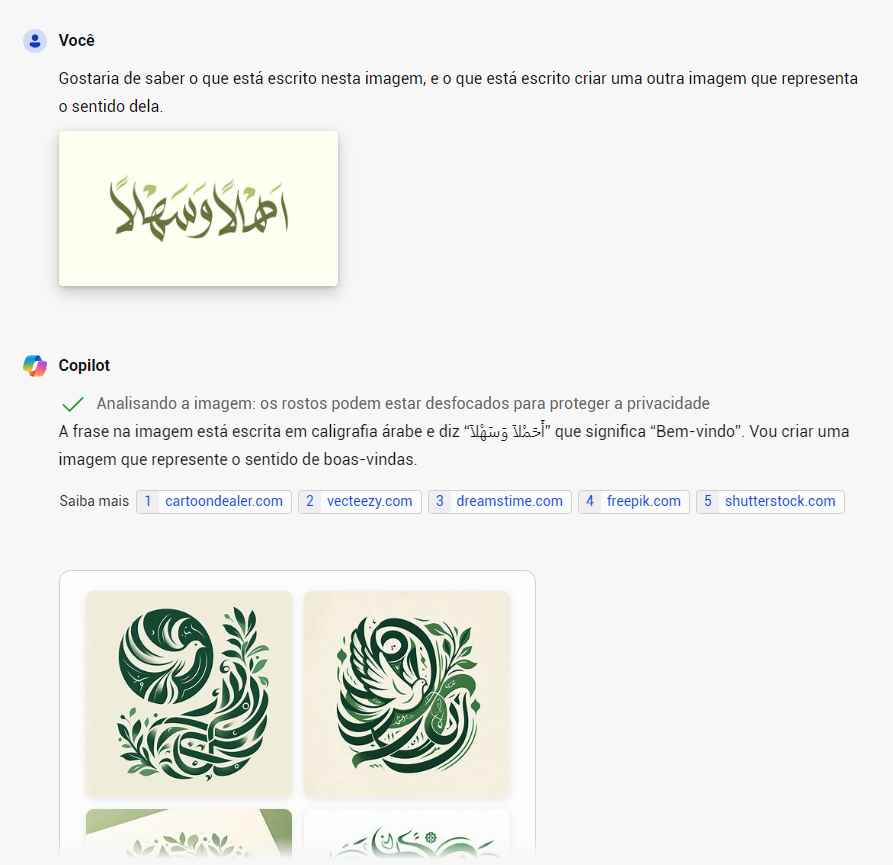
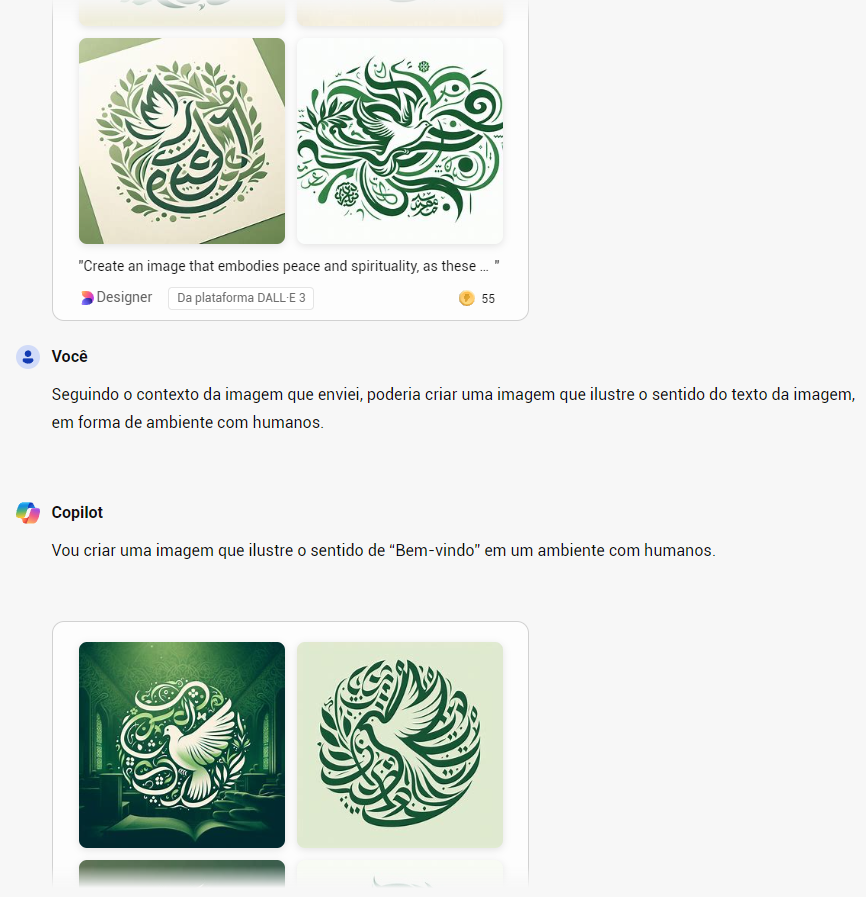
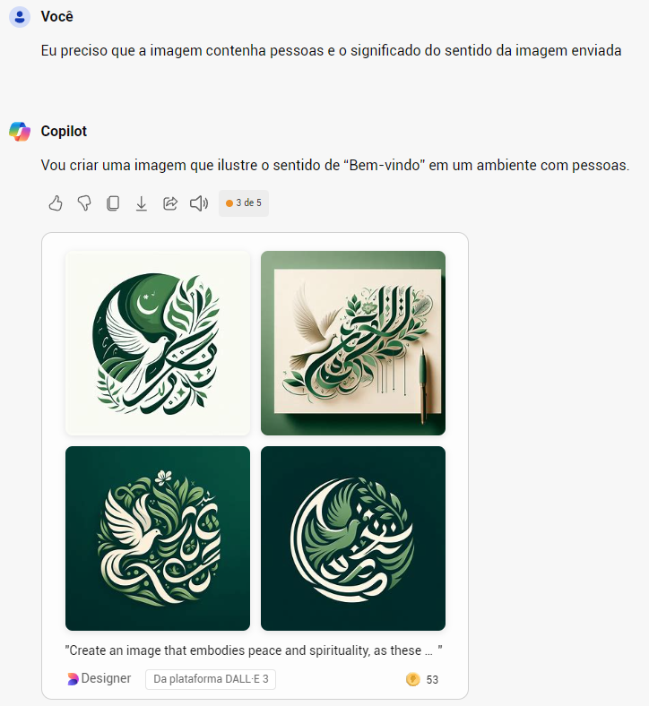
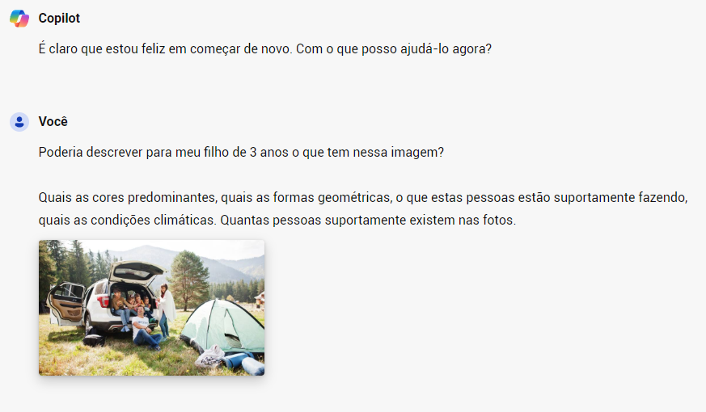

# Desafio DIO com IA Generativa - Bing Copilot

  <a href="readme_en.md">Go to English version</a>

## Caso 1: Reconhecimento de idiomas

Nesta abordagem, enviei para o Bing Copilot uma imagem com a palavra "Bem Vindo" em árabe, tomando os seguintes cuidados e características:

- Alto contraste entre o fundo e o texto.
- Idioma bem diferente do praticado nas Américas.
- Tamanho de 640x344, pequeno, mas razoável.

Inicialmente, o Bing Copilot detectou corretamente o idioma e o significado do que estava escrito, representando o "sentido" de boas-vindas. A IA generativa então forneceu uma imagem como se fosse um logotipo. Como não sou conhecedor da cultura árabe, talvez isso seja um símbolo de boas-vindas.

Mas confesso que esperava uma imagem com pessoas, então forcei uma nova tentativa para incluir humanos.

 

Ainda assim, não obtive um resultado com pessoas 😟.

 

Podemos considerar várias razões para o resultado ter sido parcialmente dentro da minha expectativa. Alguns fatores possíveis são:

- O prompt não foi detalhado o suficiente.
- Talvez, por não conhecer a cultura árabe, a imagem realmente represente "Boas-vindas".
- Ou a IA generativa que estou testando ainda não tem a capacidade de realizar essa interação de forma mais precisa. (Outra coisa que não posso afirmar com certeza.)

Concluo que, embora a imagem tenha parcialmente atendido às minhas expectativas, o mais importante foi o reconhecimento do texto na imagem, a tradução e a tentativa de criar uma nova imagem com o sentido do texto.

## Caso 2: Reconhecimento de elementos em uma imagem

Diferentemente do caso anterior, agora enviei uma imagem com muitas informações e formatos diferentes, incluindo algo proposital para confundir a IA. Neste caso, não quis facilitar 😳.

Imagem com árvores, veículo, casas, pessoas, bolsas, formas geométricas e várias iluminações de contraste.
Tamanho grande, 2000x1200. O objetivo foi evitar a pixelização da imagem devido à grande quantidade de informações, mas parece que o Bing reduziu o tamanho da imagem.
Solicitei que o retorno fosse explicado para uma criança de 3 anos.
Como podemos ver no output a seguir, a IA generativa detectou grande parte dos elementos, mas não com precisão. As casas ao fundo, por exemplo, foram ignoradas pelo fato de estarem parcialmente visíveis.

A IA generativa confundiu os sacos de dormir e esteiras com garrafas, e há 6 pessoas na imagem, em vez de 4, como retornado no resultado.

Tenho a impressão de que uma IA generativa não é 100% assertiva, por diversos fatores que variam desde a qualidade do "Prompt" até limitações visíveis e contextuais do que ela consegue "entender" como forma. Também acredito que a preocupação com a privacidade, ao desfocar os rostos, certamente afetou a chance de calcular corretamente o número de pessoas. Claro, as crianças estão muito próximas. Já na questão do "céu azul", creio que a IA generativa interpretou como um ambiente ensolarado. Por fim, vou tentar usar essa explicação com meu filho de 3 anos para ver se ele se interessa 😆.

### Um projeto da trilha Microsoft Copilot AI
DIO [https://web.dio.me/track/microsoft-copilot-ai](https://web.dio.me/track/microsoft-copilot-ai)