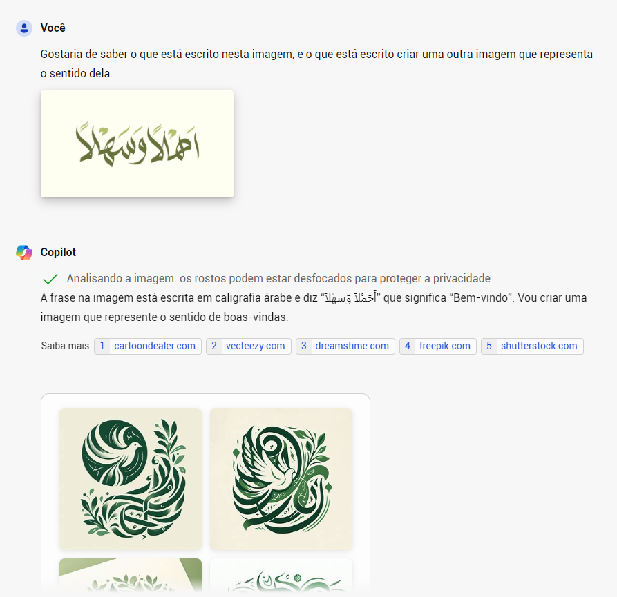

# DIO Challenge with Generative AI - Bing Copilot

  <a href="readme.md">Ir para versão em português</a>

## Case 1: Language Recognition

In this approach, I submitted an image to Bing Copilot with the word "Welcome" in Arabic, taking the following precautions and characteristics:

- High contrast between the background and the text.
- A language very different from those practiced in the Americas.
- Size of 640x344, small but reasonable.

Initially, Bing Copilot correctly detected the language and the meaning of the text, representing the "sense" of welcome. The generative AI then provided an image as if it were a logo. Since I am not familiar with Arab culture, perhaps this is a symbol of welcome.

But I confess that I was expecting an image with people, so I forced a new attempt to include humans.

 

Even so, I did not get a result with people 😟.

 

We can consider several reasons why the result was partially within my expectations. Some possible factors are:

- The prompt was not detailed enough.
- Perhaps, due to my lack of knowledge of Arab culture, the image does indeed represent "Welcome."
- Or the generative AI I am testing still lacks the capacity to perform this interaction more accurately. (Something else I cannot confirm yet.)

I conclude that although the image partially met my expectations, the most important thing was the recognition of the text in the image, the translation, and the attempt to create a new image with the meaning of the text.

## Case 2: Recognizing Elements in an Image

Unlike the previous case, I now submitted an image with many details and different shapes, including something intentional to confuse the AI. In this case, I didn’t want to make it easy 😳.

- Image with trees, a vehicle, houses, people, bags, geometric shapes, and various lighting contrasts.
- Large size, 2000x1200. The goal was to avoid pixelation of the image due to the large amount of information, but it seems Bing reduced the image size.
- I asked for the return to be explained to a 3-year-old child.

As we can see in the following output, the generative AI detected most of the elements, but not precisely. The houses in the background, for example, were ignored because they are partially visible.

The generative AI confused the sleeping bags and mats with bottles, and there are 6 people in the image instead of 4, as was returned in the result.

I have the impression that generative AI is not 100% accurate, for various reasons ranging from the quality of the "Prompt" to visible and contextual limitations of what it can "understand" as a form. I also believe that the concern for privacy, by blurring faces, certainly affected the chance to correctly calculate the number of people. Of course, the children are very close together. As for the "blue sky," I believe the generative AI interpreted it as a sunny environment. Finally, I will try using this explanation with my 3-year-old son to see if he is interested 😆.

### A project from the Microsoft Copilot AI track
DIO [https://web.dio.me/track/microsoft-copilot-ai](https://web.dio.me/track/microsoft-copilot-ai)